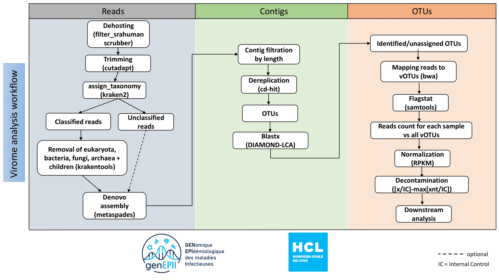

# HAP2-IBIS Virome

All codes for: Anani et al, 2025. Lung virome convergence precedes Hospital-Acquired Pneumonia in intubated critically ill patients.

Scripts shoud be run individually in independent orders.

## Contents

Shell scripts :
  -  Reads_processing_and_filtering
  -  Contigs_building_dereplication_and_taxonomic_assignment
  -  Remapping_on_viral_contigs

R scripts :

The scripts are detailed by figure

- FIGURE1
- FIGURE2
- FIGURE3
- FIGURE4
- FIGURE5
- FIGURE6

## Additional scripts
-  Clinical_table
-  Additional_shell_scripts
-  Additional_R_scripts
-  Phylogenetic_scripts
-  TKNA

## Viral Metagenomics Pipeline

